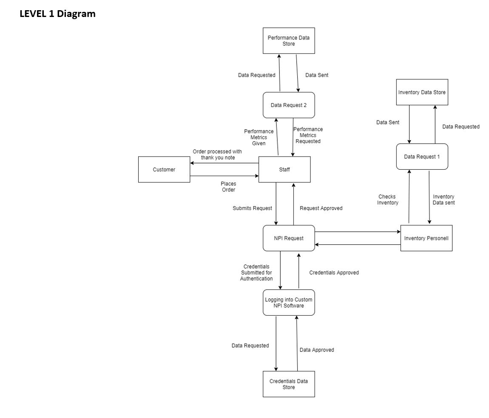

# HP Business Analyst Project Proposal

# Introduction
In the fast-paced and competitive landscape of today's business world, the ability to swiftly respond to emerging challenges and identify areas for improvement is crucial for any company aiming to gain a competitive advantage. As businesses consider undertaking new projects, they must navigate the delicate balance between time, money, and opportunity. Consequently, a data-driven approach becomes essential, with quantifiable results serving as the underlying foundation for decision-making. 

Effective project execution requires meticulous attention to detail, encompassing a comprehensive understanding of the project's purpose, budgetary considerations, timeline, and a clear vision of the desired system functionality. By providing developers with precise specifications, companies can ensure that the resulting projects precisely meet their unique needs.

A critical aspect of successful project management lies in building a repository of valuable business knowledge. This repository becomes an asset of immense value, allowing future project teams to leverage previous decision-making processes and build upon existing initiatives.

In this project, I played the role of an HP Business Analytics team member, and we were presented with a pressing challenge. The company's ticketing software was lagging behind the inventory system, leading to users ordering PCs with unavailable parts. This backlog of tickets resulted in canceled orders and significant financial losses. Our project sponsor, Kathy Thompson, the senior director of the new product integration team, estimated an annual cost of approximately $250,000 USD, with projections of a 10% year-on-year increase if the issue was not resolved. As we delved deeper into the project's implications, we recognized that there was more at stake than just the direct financial cost. We acknowledged the importance of considering the business reputation and the impact on customer retention. In a competitive market, maintaining customer loyalty is paramount, and the cost of keeping a satisfied customer is often far less than the expense of acquiring new ones.

To address this issue, Kathy tasked us with creating a data-driven proposal to justify a new project that will fix the currently broken ticketing system. Our primary goal was to assess the financial viability of the project, weighing the three critical cost trade-offs: time, money, and opportunity. Additionally, we sought to establish a comprehensive data archive that would serve as a valuable resource for the business's future endeavors.

Through rigorous analysis and data-driven decision-making, we aimed to determine whether the project warranted pursuit and how it could yield significant benefits for the company's future growth and success. 

# Problem Statement
The objective of this project is to address and resolve the existing issues with the ticketing system, which is currently not meeting the organization's operational needs. To achieve this, the project will be strategically approached with a strong emphasis on data-driven decision-making, ensuring that all proposed solutions are well-founded and aligned with the company's goals.

The project will encompass several key deliverables, each playing a crucial role in analyzing and designing an effective solution. These deliverables include:

1.	Feasibility Report: A comprehensive assessment of the project's viability, considering technical, economic, operational, and scheduling aspects.
2.	Formal Project Proposal: A detailed proposal outlining the project's scope, objectives, expected outcomes, resource requirements, and estimated timeline.
3.	Work Breakdown Structures: A structured breakdown of tasks and activities, providing a clear schedule and project roadmap.
4.	Staffing Plan: a detailed explanation of who will be performing what work.
5.	Request for Quote: a document outlining the cost of labor per department that aids in delivering a budget with greater predictability. 
6.	Event Response Map: A visual representation of potential events and their corresponding responses within the system, enabling proactive planning for system behavior.
7.	Context Diagrams: Utilizing an outside-in approach, context diagrams will highlight interactions and actions taken by users and the system, capturing the overall system complexity.
8.	Data Flow Diagrams: Visual representations of data movement and processing within the system, facilitating a comprehensive understanding of information flows.

After a thorough evaluation of the project, a project development methodology will be determined given the time frame for the project and the amount of resources available.

# Feasibility Report

# Formal Project Proposal

# Work Breakdown Structures

# Staffing Plan
To successfully create the ticketing software for NPI orders, we will assemble a skilled and dedicated team comprising various roles to ensure a comprehensive development process. The project will require a total of 13 staff members. Let's break down the staffing requirements and roles:

Software Engineers (5 members):
A team of 5 experienced software engineers will be responsible for developing the ticketing software. Their expertise and creativity will be pivotal in delivering a robust and user-friendly solution.

IT Members (5 members):
Another team of 5 IT experts will work closely with the software engineers to ensure seamless compatibility with existing database software. They will also be responsible for ensuring compatibility with HTML for a web-based interface.

NPI Staff Members (2 members):
Two NPI staff members will actively participate in analyzing different versions of the software. Their feedback on user interface, ease of access, and other project-specific needs will be crucial for successful implementation.

Kathy Thompson (NPI Senior VP):
As the project sponsor, Kathy Thompson, the NPI Senior VP, will provide vital oversight, ensuring necessary checkpoints are met. Additionally, she will act as a communication bridge between the software engineers, IT staff, and experienced NPI team members.

### Financial Requirements:

In terms of financial allocations, we estimate a budget of $10,000 for development infrastructure, and an additional $25,000 for essential software licenses to synthesize the new software effectively.

### Methodology Selection:

Considering the project's tight timeframe of three months and the need for rapid product development, we have carefully evaluated different methodologies. Based on our assessment, we have decided to adopt the Iterative methodology for the product development lifecycle.

Iterative methodology is well-suited for our requirements because it emphasizes quick development cycles while accommodating complex tasks. This will enable us to make continuous improvements and iterate upon the software in real-time. Moreover, it offers flexibility for staff members who might be less familiar with the technology, ensuring a smooth and adaptable development process.

Furthermore, the Iterative methodology allows for incremental additions of advanced features ("bells and whistles") at later stages, providing room for future enhancements. With the chosen staffing plan and the adoption of the Iterative methodology, we are confident in delivering a high-quality ticketing software that will revolutionize NPI order management and drive efficiency across the organization.

# Request for Quote

# Event Response Map

# Context Diagrams

# Data Flow Diagrams

# Conclusion
In conclusion, the development of the ticketing software for NPI orders is a pivotal project that will significantly enhance our business operations. By adopting a data-driven approach and meticulous project planning, we have identified the key requirements, staffing needs, and financial considerations for successful implementation. The chosen Iterative methodology will allow us to deliver a robust and user-friendly solution within the tight timeframe, enabling continuous improvement and adaptability. With a dedicated team of skilled software engineers, IT experts, and insightful NPI staff, we are confident in our ability to create a cutting-edge software that will streamline workflows, reduce losses, and improve customer satisfaction. This project represents a crucial step towards our long-term growth and success in an ever-evolving business landscape.

